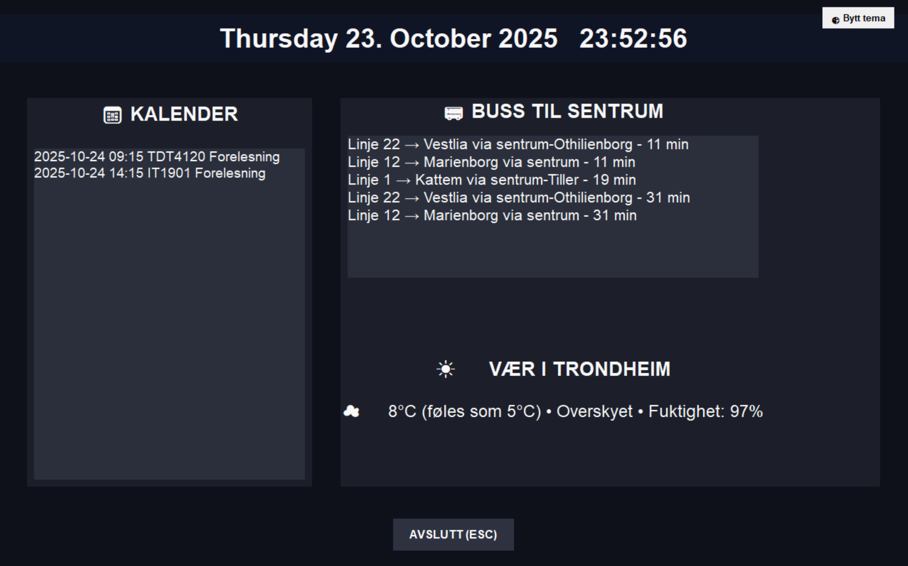

# Personal Info Dashboard

A personal dashboard for displaying upcoming calendar events, bus departures, and weather information. Features automatic dark/light mode based on time of day, with a manual toggle button.

## Features
- Multi-calendar support (Google Calendar)
- Bus schedules for a selected stop
- Local weather display
- Dark/light mode based on time or manual override
- Fullscreen Tkinter interface

## Usage
1. Place your calendar tokens in the project folder.
2. Run `app.py` to start the dashboard.

remember to refresh tokens

https://developers.google.com/workspace/calendar/api/quickstart/python

https://console.cloud.google.com/auth/audience

gota update this README soon
